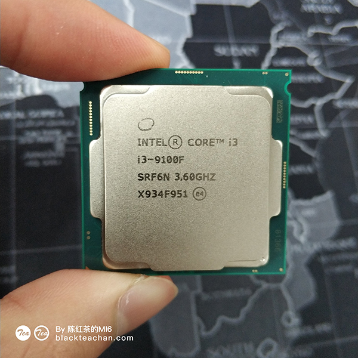

最近买了一台ITX小主机放在公司敲代码用，记录一下全过程
<!-- more -->

# 背景
公司的电脑已经不能满足我的使用需求了，如何在最低的预算下打造一台高性价比的黑苹果迷你小主机呢？  

## 方案
经过我的一番海选，最终入我眼的有两套方案：   
1. 外星人AlphaR2（A卡版）
2. ITX主机

### 方案一
第一个方案，外星人Alpha R2
1. 配置
CPU：i5 6400T
显卡：R9 M470X
内存：DDR4 8G笔记本内存
2. 优点 
主机非常小，配置还算是中规中矩，能够中低特效玩玩一些3A大作，显卡是免驱的。
最主要它是外星人啊！外星人！  
3. 缺点
缺点是拓展性差（只有一个内存槽，显卡没有升级空间，硬盘不是NVMe）
4. 价格
闲鱼大概2500以上（10.14 N卡能驱动的话可以考虑上i7 960的版本）

### 方案二
ITX主机
1. 配置
ITX的话配置就可以自己随心搭配了
2. 优点
可拓展性极强，可以自己选购配件
3. 缺点
相对于外星人AlphaR2来说体积大了好几倍
4.价格
要便宜要贵的都可以

### 最终结果
经过长达几个月的慎重考虑，我还是决定选择方案二。  
虽然方案一体积小，还是外星人，但是较差的拓展性是我不太能接受的，而且2500+的价格，足够我配一台9100F+470了。  
所以我开始入坑ITX主机之路

## ITX配件的选购
选择了ITX方案之后，等待着我的是配件的选购   
平台我首先考虑了Intel 1151平台，原本有考虑上1155或者1150用至强U，但是平台太旧了就被我PASS了
### CPU
~~毫无疑问i3默秒全！~~
CPU当然选择9100F，4C4T、全核4.0、14nm+++工艺，价格还不到500，9100FYES！

### 主板
有考虑过H110、H310、B365，后来因为打算上K39（只支持17*17），所以决定昂达的B365SD3-ITX，最高能上DDR3 1866 16Gx2，一个M.2网卡，一个M.2固态（SATA协议）。  
不得不说这个主板的电容设计很坑，会挡住散热器。
### 内存
暂时使用X79上拆下来的十铨马甲条，后期打算换成昂达的专用条，可以上到单条16G 1866Mhz。
### 显卡
黑苹果N卡方面图灵就直接PASS了，A卡方面的话，470、570、480、580都蛮便宜的，但是年后突然消失了一大片，全新的价格也比较贵，不是很划算，还要考虑显卡长度。  
因此上了百亿补贴的车，999入了一张R9 Nano（人生第一张A卡）。
### 电源
首席玩家400W 1U电源，非常静音，带9100F R9nano完全没有问题。
### 机箱
SGPC家的K39，内部较为紧凑，预留两个2.5吋SATA硬盘位。
### 散热器
暂时使用IS40X散热器，因为太高挡住侧板，新买的HP400正在路上。